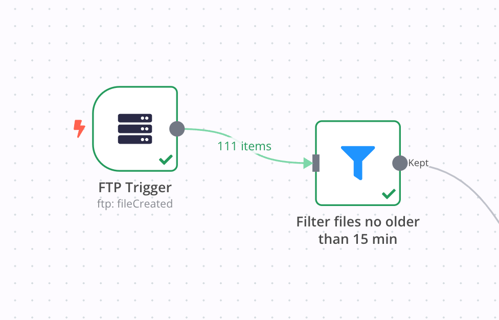

# (S)FTP Trigger Node for n8n

The FTP Trigger node is a custom-built node for n8n that triggers a workflow on FTP or SFTP filesystem changes. The node listens to a specified FTP or SFTP server and triggers a workflow when a specific event occurs. Events can include file or folder creation, deletion, or updates. The node can monitor a specific folder or any file/folder in the filesystem.

[n8n](https://n8n.io/) is a [fair-code licensed](https://docs.n8n.io/reference/license/) workflow automation platform.

## Features
* Support for both FTP and SFTP protocols.
* Ability to trigger on various filesystem events.
* Support for watching specific files or folders.

## Installation

Follow the [installation guide](https://docs.n8n.io/integrations/community-nodes/installation/) in the n8n community nodes documentation.

## Events

* **File Created**: Triggered when a new file is created in the specified folder or directory.
* **File Updated**: Triggered when an existing file in the specified folder or directory is updated.
* **File Deleted**: Triggered when a file is deleted from the specified folder or directory.
* **Folder Created**: Triggered when a new folder is created in the specified directory.
* **Folder Updated**: Triggered when an existing folder in the specified directory is updated.
* **Folder Deleted**: Triggered when a folder is deleted from the specified directory.
* **Watch Folder Updated**: Triggered when the watched folder itself is modified.

## Credentials

You can use your existing FTP or SFTP credentials.

## Resources

* [n8n community nodes documentation](https://docs.n8n.io/integrations/community-nodes/)

## Contribution

If you find any bugs, or want to contribute to the further development of this node, please create an issue or a pull request in this repository.

## Disclaimer

This project is in no way affiliated with, authorized, maintained, sponsored, or endorsed by n8n or any of its affiliates or subsidiaries. This is an independent and unofficial software. Use at your own risk.
